# Advanced Programming Final Project - Papikos by Group K03
## **Group Members**
Catherine Aurellia (2306256261) 
Athazahra Nabila Ruby (2306173113)  
Darren Marcello Sidabutar (2306256293) 
William Samuel Mulya (2306199775) 
Muhammad Raditya Indrastata Norman (2306256450)  

## **Project Description**
PapiKos is a boarding house rental application that connects landlords with potential tenants safely and quickly. This application allows tenants to search for, rent, and pay for boarding houses easily, while also helping landlords manage their properties more practically and in an organized manner.

## **Work Distribution**
* Authentication: All
* Boarding House Rental: Darren Marcello Sidabutar
* Boarding House Management: Athazahra Nabila Ruby
* Payment Processing: William Samuel Mulya
* Chat: Muhammad Raditya Indrastata Norman
* Wishlist & Notification: Catherine Aurellia

## URL(s) to the group project repository/ies:
[Papikos Repository](https://github.com/Group3-AdvProg/papikos)

## URL(s) to the technical documents:
[Papkos Technical Docs](https://docs.google.com/document/d/1UUP2N7lyEjMo6M4J-rEnBAB-YIbCyOc5ocVgWecGnYU/edit?tab=t.0)

## Software Architecture Implementation
### 1. Current Architecture
Context Diagram

Container Diagram

Deployment Diagram

### 2. Future Architecture
Future Context Diagram
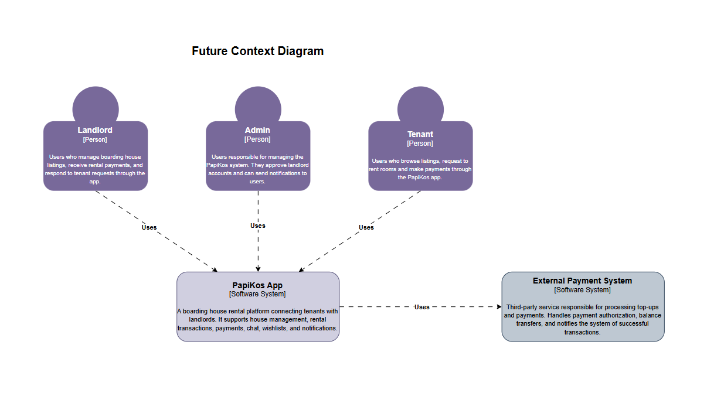

Future Container Diagram
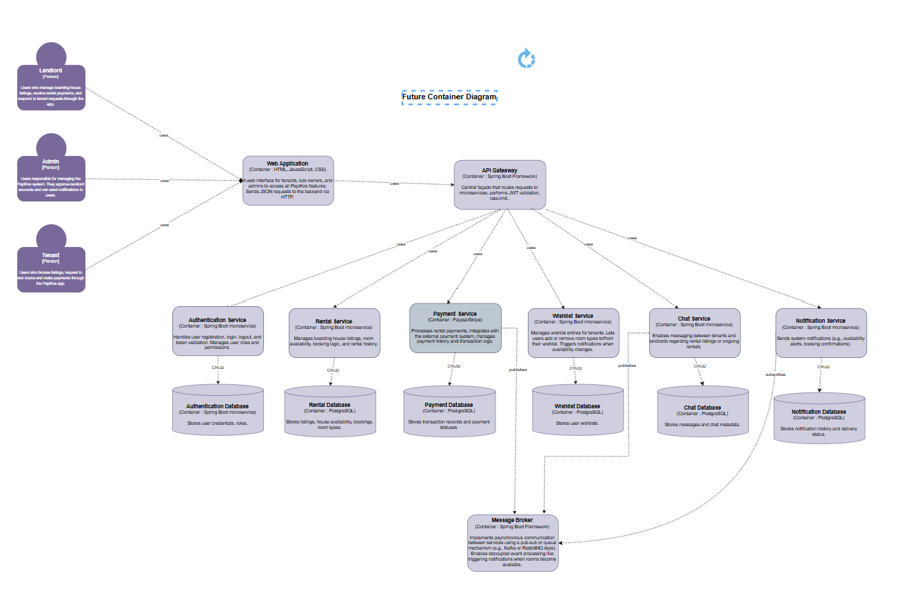

## Risk Analysis
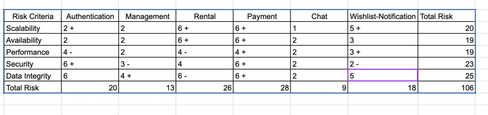

## Context Diagram after Risk Analysis
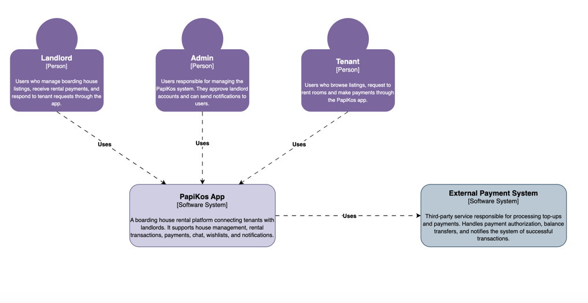

## Container Diagram after Risk Analysis
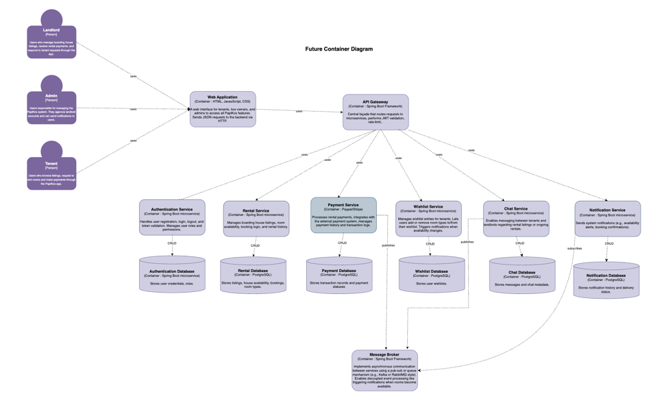

### 3. Risk Storming
Our risk assessment highlighted four areas of highest concern: Payment processing, Data integrity, Scalability, and Security. Payment workflows scored a 28 / 30 due to their direct exposure to financial fraud and chargebacks, so isolating transaction logic in its own service and offloading card handling to a PCI-compliant gateway was essential. Data integrity followed closely (25 / 30), driven by the danger of cross-service transaction failures; we now enforce a “database-per-service” pattern to contain each domain’s data and ensure transactional boundaries cannot bleed into unrelated modules. Scalability (total 39 across Availability and Performance) and Security (23 / 30) risks were mitigated by introducing both an API Gateway for centralized authentication/authorization, rate-limiting, and TLS termination, and a Redis cache to absorb read-heavy traffic.

To address these hotspots, the monolithic backend was refactored into six Spring Boot microservices: Authentication, Rental, Payment, Wishlist, Chat, and Notification. Each service owns its own PostgreSQL schema. We put an Azure API Management front door in front of our API Gateway, decoupling client-facing concerns from business logic and shrinking our attack surface. Asynchronous events (e.g. “room available”, “payment succeeded”, “new message”) now flow through a managed message broker. This decouples real-time updates from critical request paths and bolsters both availability and maintainability.

These changes collectively reduce our operational scope, enforce stricter security domains (by isolating sensitive logic), and provide clear scaling boundaries for each service. The result is a more resilient, secure, and maintainable architecture that directly addresses the risks identified in our analysis.

### 4. Individual Diagrams

#### Rental - Darren Marcello Sidabutar
Component Diagram
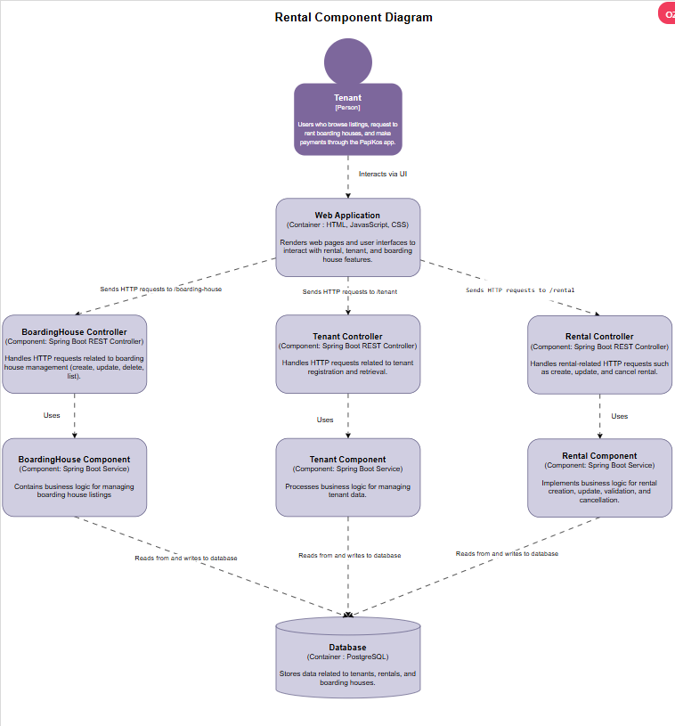

Code Diagram
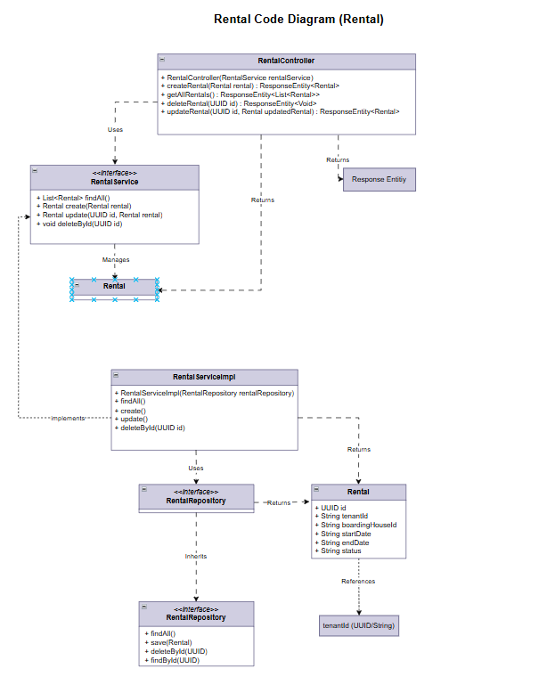
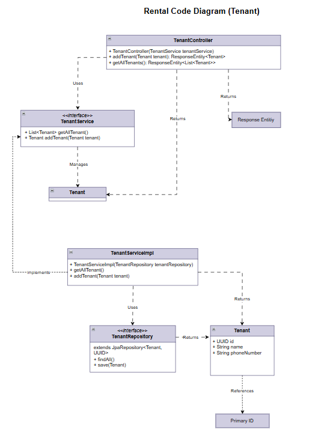
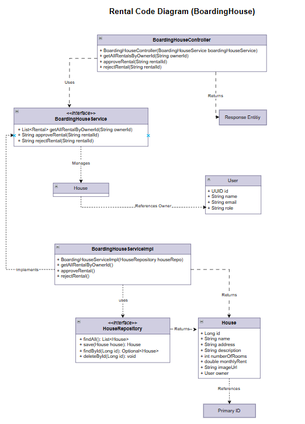

#### House Management - Athazahra Nabila Ruby
Component Diagram

Code Diagram

#### Payment - William Samuel Mulya
Component Diagram
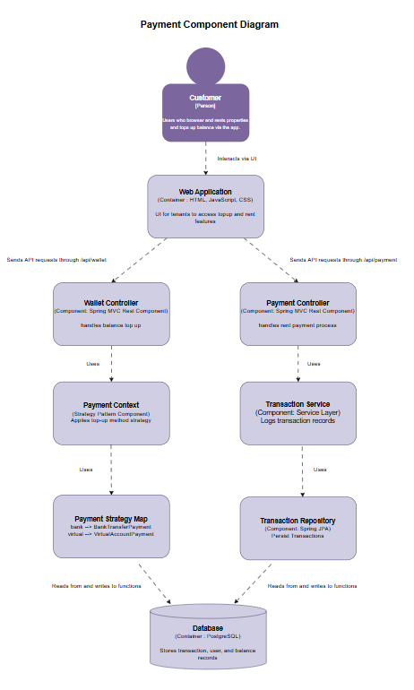

Code Diagram
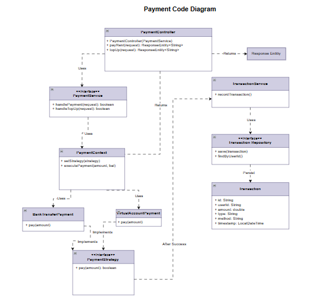

#### Chat - Muhammad Raditya Indrastata Norman
Component Diagram
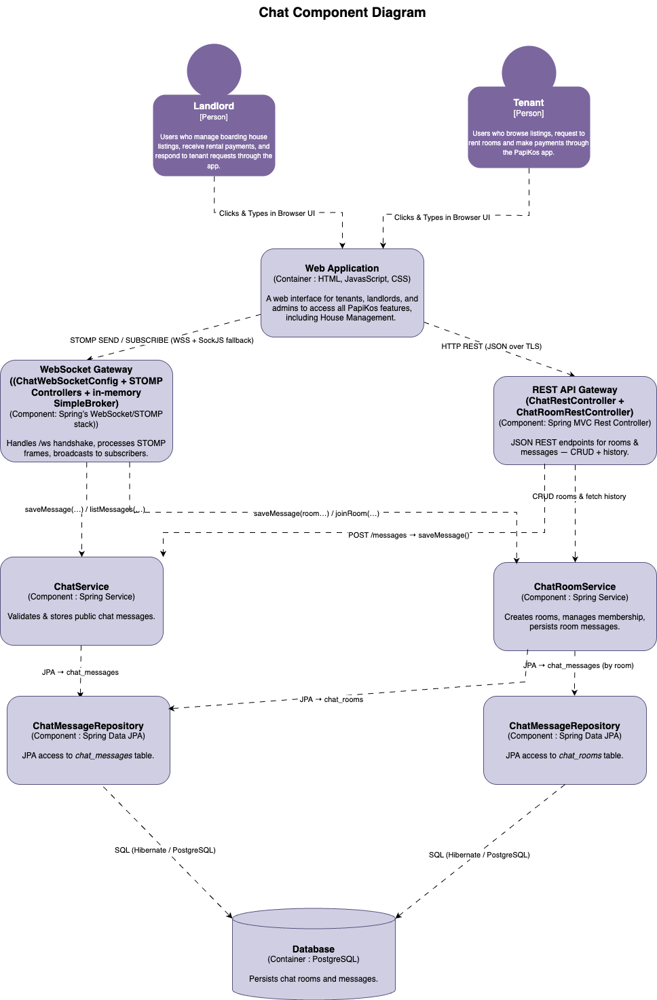

Code Diagram
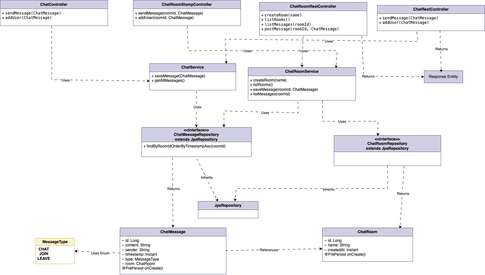