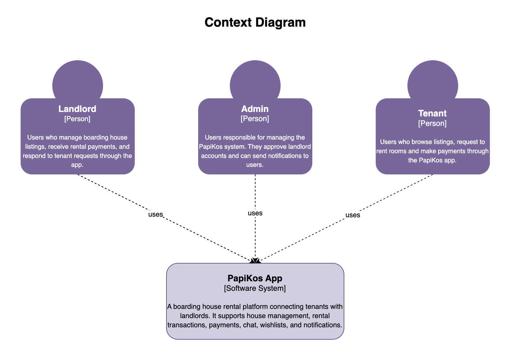
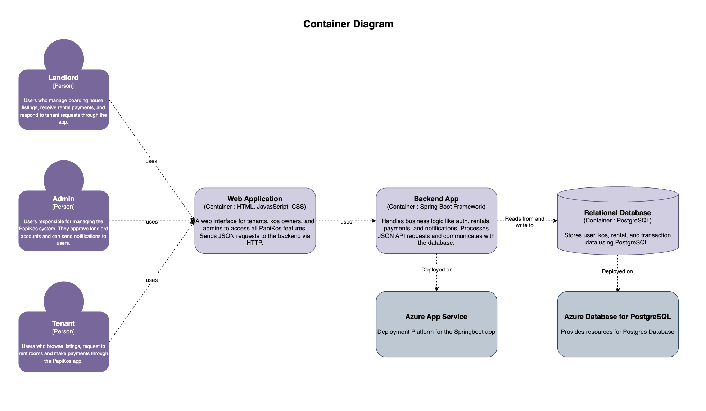
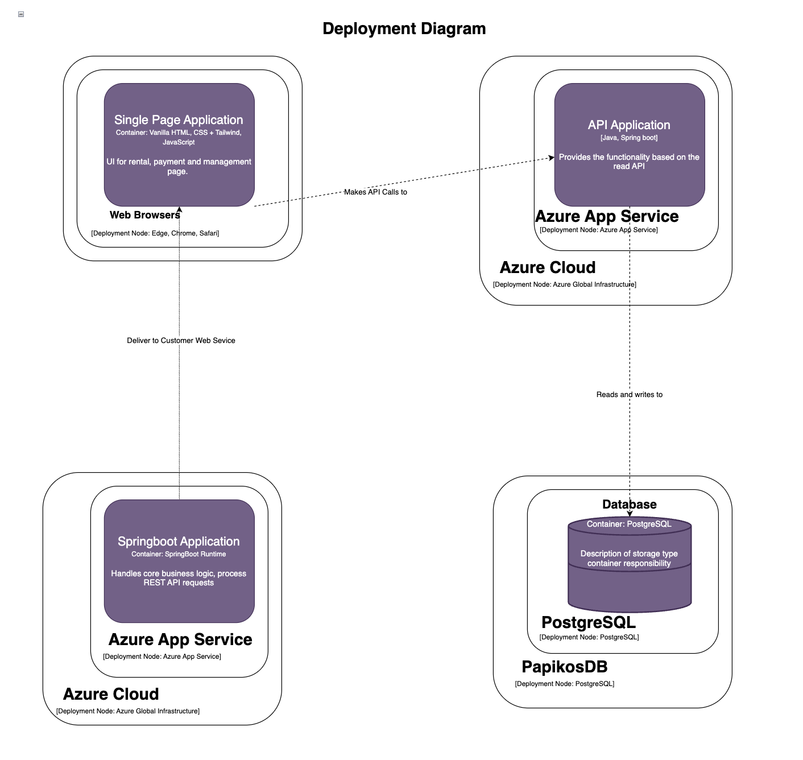
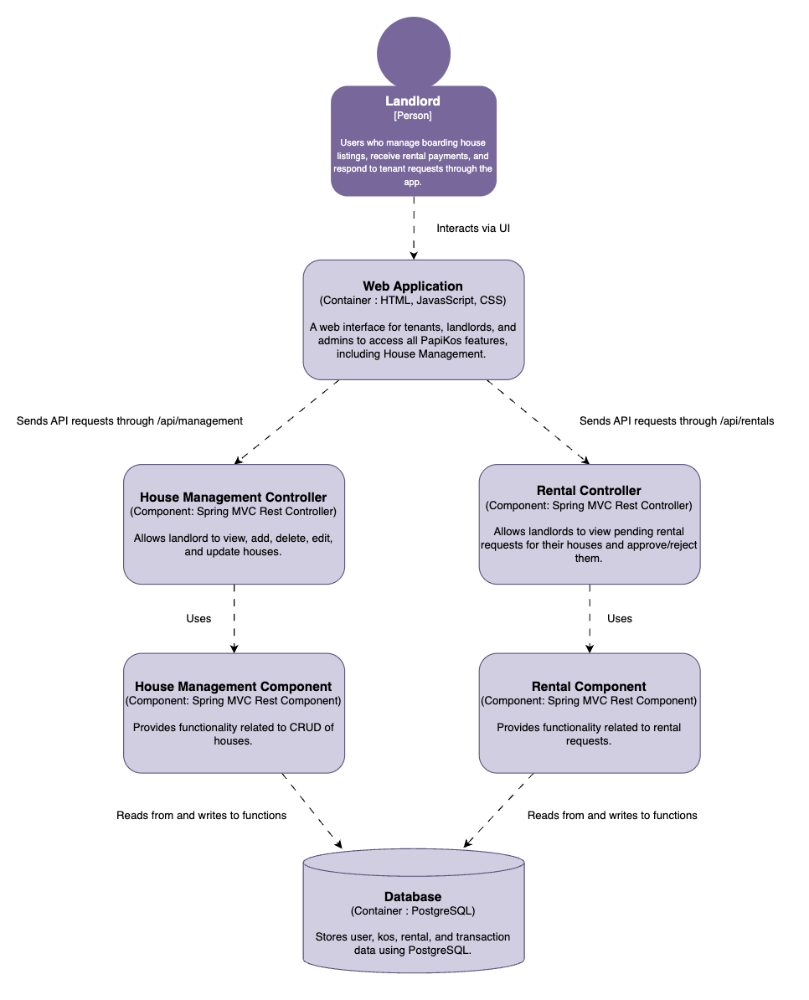
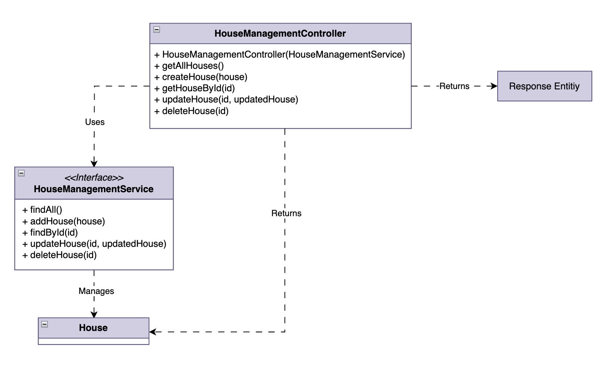
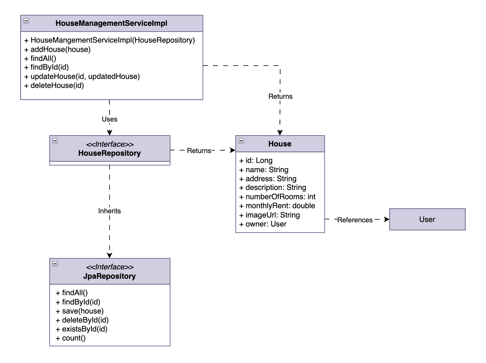

# Advanced Programming Final Project - Papikos by Group K03
## **Group Members**
Catherine Aurellia (2306256261) 
Athazahra Nabila Ruby (2306173113)  
Darren Marcello Sidabutar (2306256293) 
William Samuel Mulya (2306199775) 
Muhammad Raditya Indrastata Norman (2306256450)  

## **Project Description**
PapiKos is a boarding house rental application that connects landlords with potential tenants safely and quickly. This application allows tenants to search for, rent, and pay for boarding houses easily, while also helping landlords manage their properties more practically and in an organized manner.

## **Work Distribution**
* Authentication: All
* Boarding House Rental: Darren Marcello Sidabutar
* Boarding House Management: Athazahra Nabila Ruby
* Payment Processing: William Samuel Mulya
* Chat: Muhammad Raditya Indrastata Norman
* Wishlist & Notification: Catherine Aurellia

## URL(s) to the group project repository/ies:
[Papikos Repository](https://github.com/Group3-AdvProg/papikos)

## URL(s) to the technical documents:
[Papkos Technical Docs](https://docs.google.com/document/d/1UUP2N7lyEjMo6M4J-rEnBAB-YIbCyOc5ocVgWecGnYU/edit?tab=t.0)

## Software Architecture Implementation
### 1. Current Architecture
Context Diagram

Container Diagram

Deployment Diagram

### 2. Future Architecture

### 3. Risk Storming

### 4. Individual Diagrams

#### House Management - Athazahra Nabila Ruby
Component Diagram

Code Diagram

